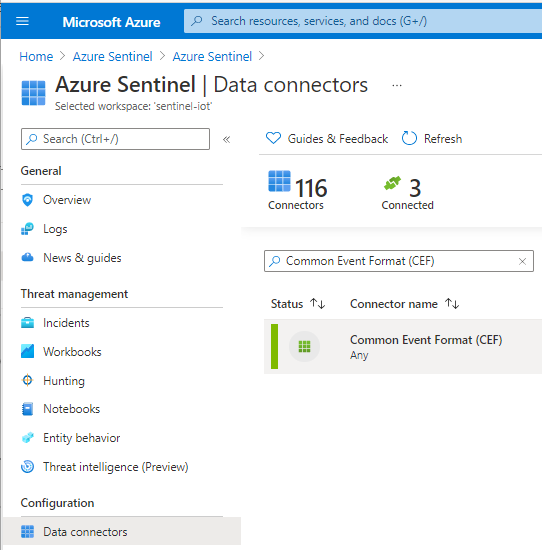
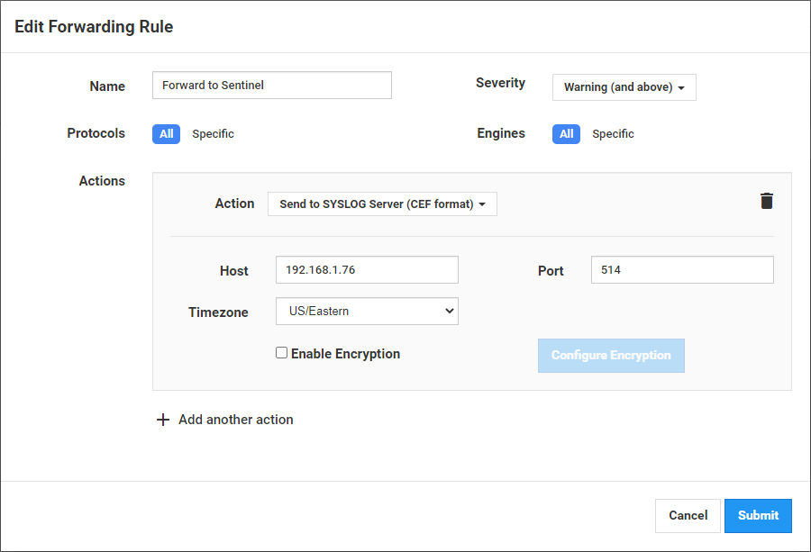
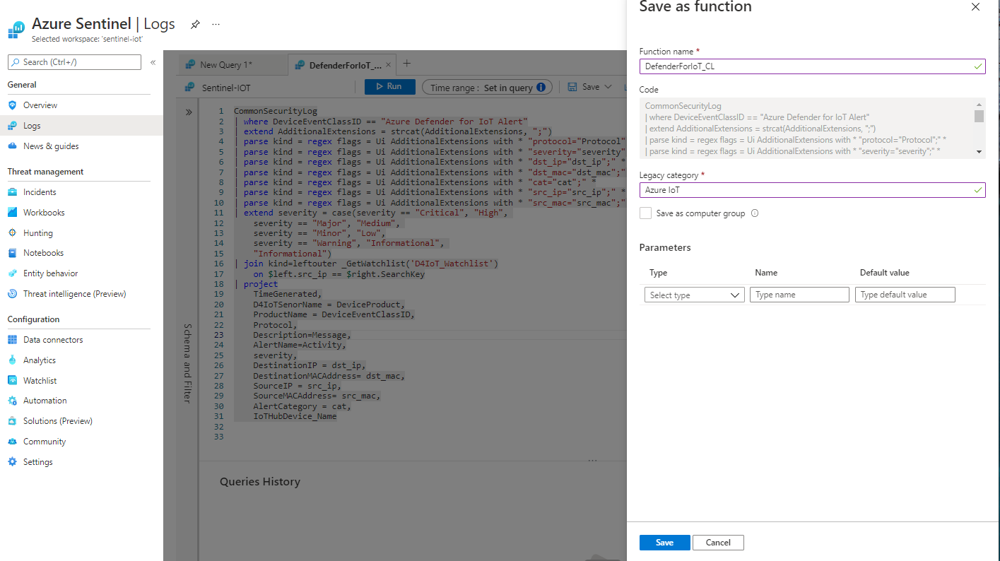
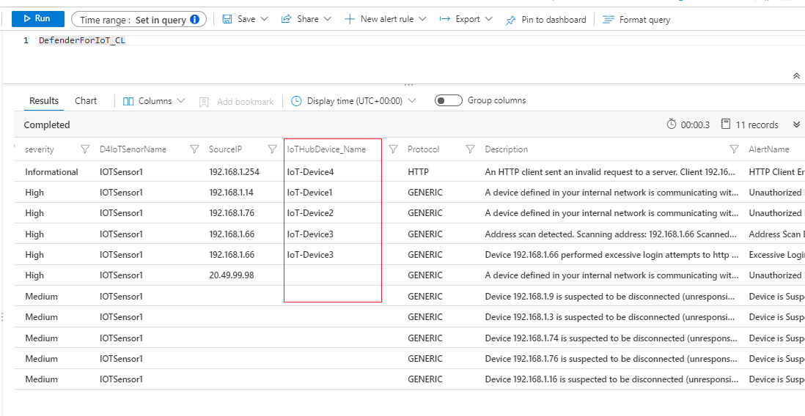
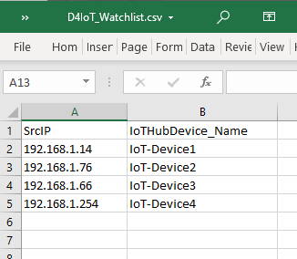
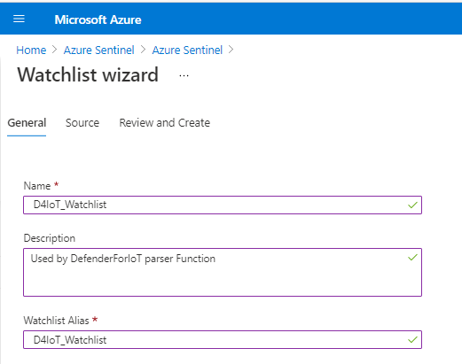
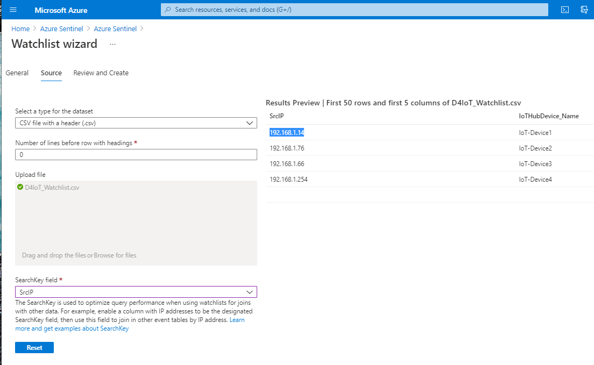
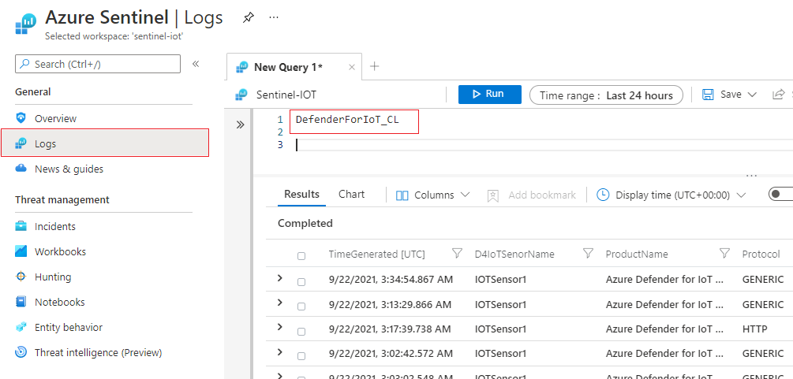

# **Azure Defender for IoT Data Connector Configuration**

## **Table of Contents**

1.  <u>Getting Started</u>

    -   <u>Prerequisites</u>

    -   <u>Installation</u>

2.  <u>Usage</u>

3.  <u>Contact</u>

 

## **Getting Started**

Use the following steps to correctly configure Defender for IoT data
connector in your Azure Sentinel instance

This Data connector contains the following components:

1.  Configuration of Syslog Server

2.  Installing of Azure Sentinel Parser

3.  Configuration of Azure Sentinel Watchlist

 

## **Prerequisites**

-   Instance of Azure Sentinel
    [Deployed](https://docs.microsoft.com/en-us/azure/sentinel/quickstart-onboard).

 

## **Installation** 

  

  ## ***<u>Syslog Server Configuration</u>*** 

**1. Linux Syslog agent configuration**

Install and configure the Linux agent to collect your Common Event
Format (CEF) Syslog messages and forward them to Azure Sentinel.

Notice that the data from all regions will be stored in the selected
workspace

**1.1 Select or create a Linux machine**
Select or create a Linux machine that Azure Sentinel will use as the
proxy between your security solution and Azure Sentinel this machine
can be on your on-prem environment, Azure or other clouds.

**1.2 Install the CEF collector on the Linux machine**

Install the Microsoft Monitoring Agent on your Linux machine and
configure the machine to listen on the necessary port and forward
messages to your Azure Sentinel workspace. The CEF collector collects
CEF messages on port 514 TCP.

1.  Make sure that you have Python on your machine using the following
    

2.  You must have elevated permissions (sudo) on your machine.

3.  Execute the install script. The install script can be located under
    **CEF data connector** in Azure Sentinel

> 

**2. Forward Common Event Format (CEF) logs to Syslog agent**

To create a new forwarding rule on a IoT sensor:

1.  Sign into the sensor.

2.  Select **Forwarding** on the side menu.

3.  Select **Create** Forwarding Rule.

> 

4.  Enter a name for the forwarding rule.

5.  Select **Warning and Above** option from severity level drop down.

6.  Set protocols drop down to **ALL**.

7.  Set the Engines drop down to **ALL**.

8.  Select Send To SYSLOG Server (CEF Format) for actions drop down

9.  Enter syslog host IP address and set port to 514

10. Click Submit to create the forwarding rule

  

## ***<u>Installing Azure Sentinel Parser</u>***

**1. Install Log Analytics Parser**

1.  Navigate to [Parser.txt file](https://github.com/CriticalStart-Microsoft-Services/AzureSentinelSolution-Defender-for-IoT/blob/main/Parser/KQLFunction.txt)

2.  Copy parser query available

3.  Navigate to **Azure Sentinel->Logs** and paste the parser query

4.  Select **Save As Function**

5.  Provide function name as **DefenderForIoT_CL** and save

> 
>
> 

## 

  

## ***<u>Configuration of Azure Sentinel Watchlist</u>***

Watchlist is only required if you want the IoT-Hub Device name to be
 included in the **DefenderForIoT_CL** table. If not need than edit the
 Function query in the previous step to remove WatchList dependency.
 Having IoT-Device name will help identify the correct IoT-Hub for
 incident response.

 

 **1. Create CSV Upload File**

1.  Create a two column CSV file. Column names should set as below

***<u>Note:</u>*** Column name should be exactly as shown below. Use the
template provided here.

 

2.  SrcIP Column should have IP address assigned to individual IoT
    Devices and IoTHubDevice_Name column should have the corresponding
    IoT Service Device name (e.g. Azure IoT Hub Device name)

## **2. Create a new watchlist**

1.  From the Azure portal, navigate to **Azure
    Sentinel** > **Configuration** > **Watchlist** and then select **+
     Add new**.

 

2.  On the **General** page, provide the following details

        Name: **D4IoT_Watchlist**

        Description: **Used by DefenderForIoT parser Function**

        Alias: **D4IoT_Watchlist**

 

3.  Select **Next: Source**.

4.  On the **Source** page, select the dataset type (currently only CSV
     is available)

    1.  Click the **Browse for files** link in the **Upload file** box
         and select the CSV file create in the previous step and
         upload.

    2.  You will see a preview of the first 50 rows of results in the
         wizard screen.

4.  In the **SearchKey** field, Select **SrcIP**

5.  Select **Next: Review and Create**.

 

  

## **Usage**

After the parser is install correctly, you can query
**DefenderForIoT_CL** table in Azure Sentinel logs.

 

 

## **Contact**

Email: <MicrosoftTeam@criticalstart.com>

 

## **About**

What we do:  
**Managed Detection and Response (MDR) Services:*** CRITICALSTART is the only MDR provider committed to eliminating acceptable risk and leaving nothing to chance. That’s why our security experts built a system, platform & service that quickly detects every event, resolves every alert & stops breaches.
Expertise beyond MDR, through our TEAMARES red and blue teams, including class-leading security practitioners (pen testers, assessors, forensic examiners) that provide hands-on support and expertise.   
**Cybersecurity Consulting services for Microsoft:** Delivered by highly trained and certified specialists, these services including educational workshops, assessments, design and implementation of Microsoft Security solutions.

