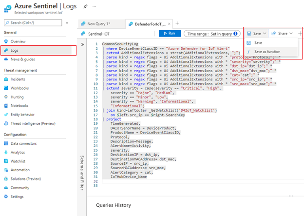
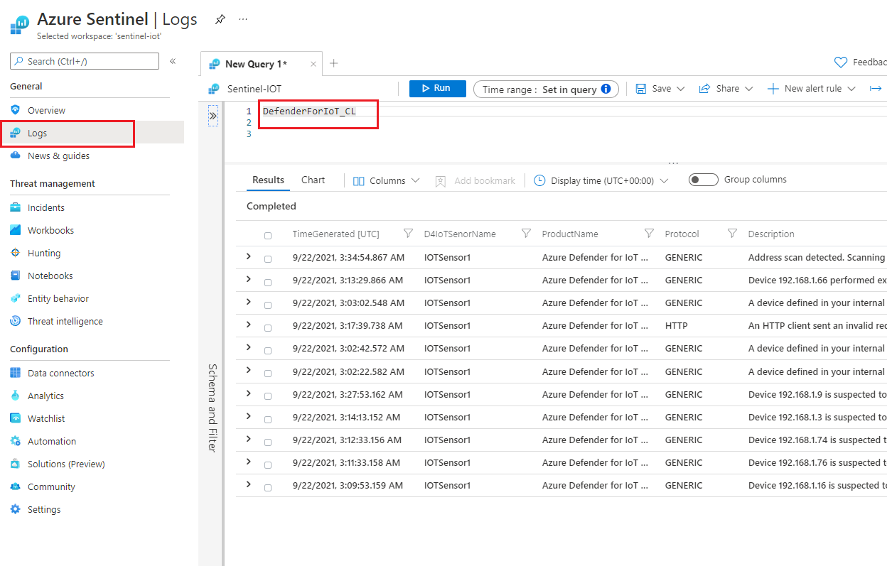

# Azure Sentinel Parser - Defender for IoT

## Table of Contents

1.  <u>Getting Started</u>

    -   <u>Prerequisites</u>

    -   <u>Installation</u>

2.  <u>Usage</u>

3.  <u>Contact</u>

 

## Getting Started

Use the following steps to correctly configure Defender for IoT Parser
in your Azure Sentinel instance.

 

## Prerequisites

The workbook require you have Syslog data connector enabled and parser
installed.

-   Please refer to the data connector content
    [here.](https://github.com/CriticalStart-Microsoft-Services/Azure-Sentinel---Defender-for-IoT/tree/main/Data%20Connector)

 

## Installing Azure Sentinel Parser

**1. Install Log Analytics Parser**

1.  Navigate to
    [repo.](https://github.com/CriticalStart-Microsoft-Services/Azure-Sentinel---Defender-for-IoT/tree/main/Parser)

2.  Copy parser query available

3.  Navigate to **Azure Sentinel->Logs** and paste the parser query

4.  Select **Save As Function**

5.  Provide function name as **DefenderForIoT_CL** and save

> 
>
> 

 

## Usage

To use the new parser, navigate to Azure Sentinel->Logs and run
“DefenderForIoT_CL”

>

 

## Contact

Email: <MicrosoftTeam@criticalstart.com>

## About

What we do:  
**Managed Detection and Response (MDR) Services:*** CRITICALSTART is the only MDR provider committed to eliminating acceptable risk and leaving nothing to chance. That’s why our security experts built a system, platform & service that quickly detects every event, resolves every alert & stops breaches.
Expertise beyond MDR, through our TEAMARES red and blue teams, including class-leading security practitioners (pen testers, assessors, forensic examiners) that provide hands-on support and expertise.   
**Cybersecurity Consulting services for Microsoft:** Delivered by highly trained and certified specialists, these services including educational workshops, assessments, design and implementation of Microsoft Security solutions.

