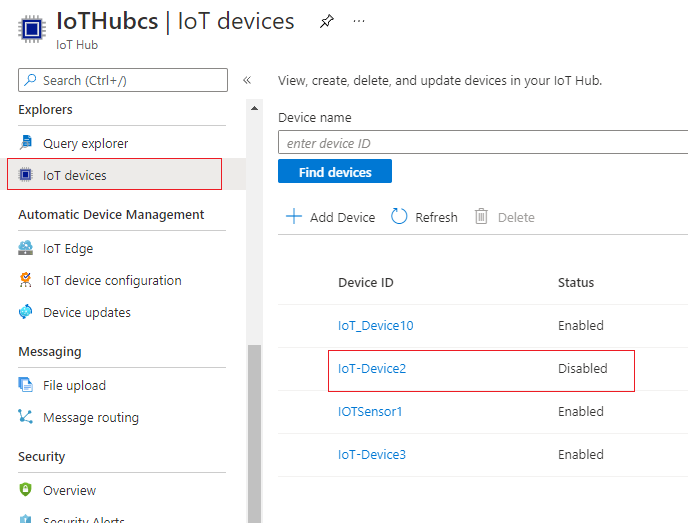
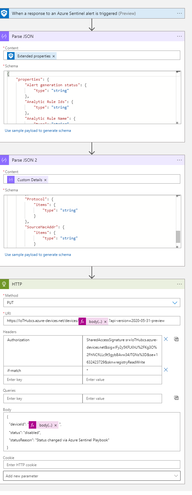

# Azure Sentinel Playbook - Defender for IoT

>Block Azure IoT Hub Device Automation

Block-Hub-Device can be used to **disable** device communication to
Azure IoT Hub.

 

<br/><br/>

## Table of Contents

1.  <u>Getting Started</u>

    -   <u>Prerequisites</u>

    -   <u>Installation</u>

2.  <u>Usage</u>

3.  <u>Contact</u>

<br/>

## Getting Started

Use the following steps to correctly configure Block-Hub-Device
Automation in your Azure Sentinel instance

<br/>

## Prerequisites

These detections require you have Syslog data connector enabled and
parser installed.

-   Please refer to the data connector content here.

-   Generate SAS token using Azure CLI
```
   az iot hub generate-sas-token -n "MyHubName" --policy registryReadWrite --du 31560000
```

-   The SAS token has the following format:
```
SharedAccessSignature sig={signature-string}&se={expiry}&skn={policyName}&sr={URL-encoded-resourceURI}
```
<br/>

## Installation

1.  Download Block-Hub-Device.json file

2.  Navigate to Azure-> Deploy A Custom -> Template(https://portal.azure.com/#create/Microsoft.Template)

3.  Click ‘Build your own template in the editor’ and upload json file

4.  Provide the IoT Hub Name and SAS token generated in the
    > Prerequisites section.

5.  Click “Review and Create.”

> 

6.  After deployment navigate to Azure->Logic App->Block-Hub-Device to
    inspect the logic app created.



<br/><br/>

## Usage

SOC can execute the Playbook on-demand from Azure Sentinel.

To run a playbook on-demand:

1.  In the **Incidents** page, select an incident and click on **View
    full details**.

2.  In the **Alerts** tab, click on the alert you want to run the
    playbook on, and scroll all the way to the right and click **View
    playbooks** and select **Block-Hub-Device** to **run** from the list
    of available playbooks on the subscription.

<br/>

## Contact

Email: <MicrosoftTeam@criticalstart.com>

<br/>

## About

What we do:</br></br>
**Managed Detection and Response (MDR) Services:*** CRITICALSTART is the only MDR provider committed to eliminating acceptable risk and leaving nothing to chance. That’s why our security experts built a system, platform & service that quickly detects every event, resolves every alert & stops breaches.
Expertise beyond MDR, through our TEAMARES red and blue teams, including class-leading security practitioners (pen testers, assessors, forensic examiners) that provide hands-on support and expertise. </br></br>
**Cybersecurity Consulting services for Microsoft:** Delivered by highly trained and certified specialists, these services including educational workshops, assessments, design and implementation of Microsoft Security solutions.


