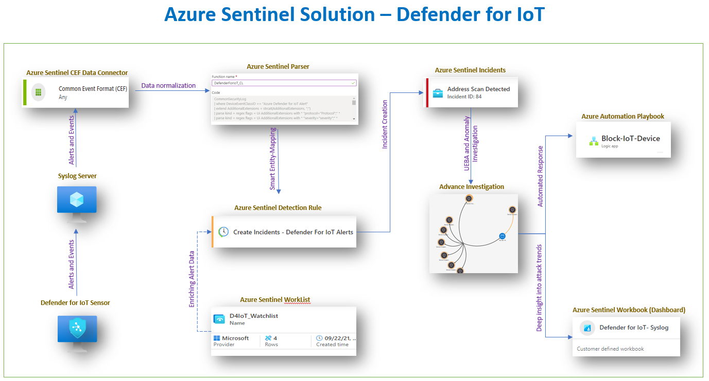

# **Azure Sentinel Solution – Defender for IoT**

Welcome to the Azure Sentinel repository! This repository contains
detections, exploration queries, hunting queries, workbooks, playbooks
and much more to help you get started with using Azure Sentinel to
secure your **IoT** environment and hunt for threats.

## **Solution Overview**

The solution uses Azure Sentinel CEF data connector to stream alerts and
events generated by Defender for IoT Sensors to Azure Log Analytics
Workspace. Log data are further normalized using a custom parser. As
part of the solution, there is also a Smart Detection Rule provided.
Defender for IoT produces rich alerts containing detailed alert
descriptions and names, this information is dynamically added to all
alerts created by the provided Smart Detection Rule. The rules also do
proper Entity-Mapping so entities like IP can be used by UEBA, Advance
investigations, and Anomaly Detection.

Lastly, the solution contains an automation playbook and an interactive
dashboard (workbook). SOC can use an automation playbook to disable
registered devices in Azure IoT Hub which will block the compromised
device from further communicating with the IoT Hub service. The workbook
offers an in-depth insight into attack trends and helps prioritize
remediation efforts.

  

## ***<u>Solution Components</u>***

 

1.  **Data Connector**

    This solution **requires** Azure Sentinel CEF data connector to stream
    alerts and events for Defender for IoT Sensors. Please follow
    instruction
    [here](https://github.com/CriticalStart-Microsoft-Services/Azure-Sentinel-Defender-for-IoT/tree/main/Data%20Connector)
    to:

    -   Enable CEF data connector in Azure Sentinel

    -   Configure local Syslog Server

    -   Configure Log forwarding from Defender for IoT Sensors to Syslog
    Server

    -   Install Azure Sentinel custom Parser

    -   Install Azure Sentinel custom Watchlist

    -   Perform validation testing

 

2.  **Parser**

    This solution **requires** installation of an Azure Sentinel custom
    parser to normalize fields for log collected from Defender for IoT
    Sensors, please follow instructions
    [here](https://github.com/CriticalStart-Microsoft-Services/Azure-Sentinel-Defender-for-IoT/tree/main/Parser)
    to:

    -   Install custom parser in log analytics workspace

    -   Perform validation testing

 

3.  **Watchlist**

    This solution **requires** installation of an Azure Sentinel custom
    watchlist. Watchlist is used to enrich incidents by adding Azure IoT
    Devices names to the alerts metadata, please follow instructions
    [here](https://github.com/CriticalStart-Microsoft-Services/Azure-Sentinel-Defender-for-IoT/tree/main/WatchList)
    to:

    -   Install custom watchlist in Azure Sentinel

    -   Perform validation testing

 

4.  **Analytics Rules**

    This solution **requires** installation of Azure Sentinel custom
    detection rules. There is a dynamic analytics rule provided that will
    auto-populate the Alert Name, Description and Severity fields based on
    the Defender for IoT Sensor detection data, please follow instructions
    [here](https://github.com/CriticalStart-Microsoft-Services/Azure-Sentinel-Defender-for-IoT/tree/main/Analytics%20Rules)
    to:

    -   Import custom detection rules provide as part of the solution

    -   Perform validation testing

 

5.  **Automation Playbook**

    An Azure Sentinel Automation Playbook is provided as part of the
    solution. The playbook can be used by SOC to disable a registered device
    in Azure IoT Hub, blocking the compromise device communication to
    back-end solutions, please follow instructions
    [here](https://github.com/CriticalStart-Microsoft-Services/Azure-Sentinel-Defender-for-IoT/tree/main/Playbook)
    to:

    -   Deploy playbook provide as part of the solution

    -   Perform validation testing

 

6.  **Workbook (Interactive Dashboard)**

    An Azure Sentinel Workbook is provided as part of the solution. The
    workbook is design to provide in-dept attack insights of your IoT
    environment, please follow instructions
    [here](https://github.com/CriticalStart-Microsoft-Services/Azure-Sentinel-Defender-for-IoT/tree/main/WorkBook)
    to:

    -   Deploy workbook provide as part of the solution

    -   Perform validation testing

 

 

You can also submit
to <u>i</u>[ssues](https://github.com/CriticalStart-Microsoft-Services/Azure-Sentinel---Defender-for-IoT/issues) for
any samples or resources you would like to see here as you onboard this
Azure Sentinel Solution. For questions and feedback, please
contact <MicrosoftTeam@criticalstart.com>

 

## **About**

Add Something Here

