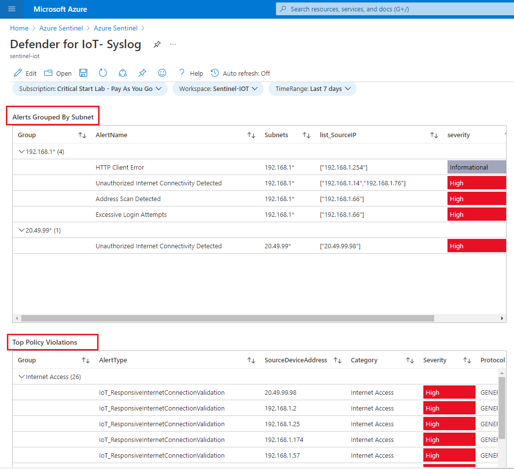
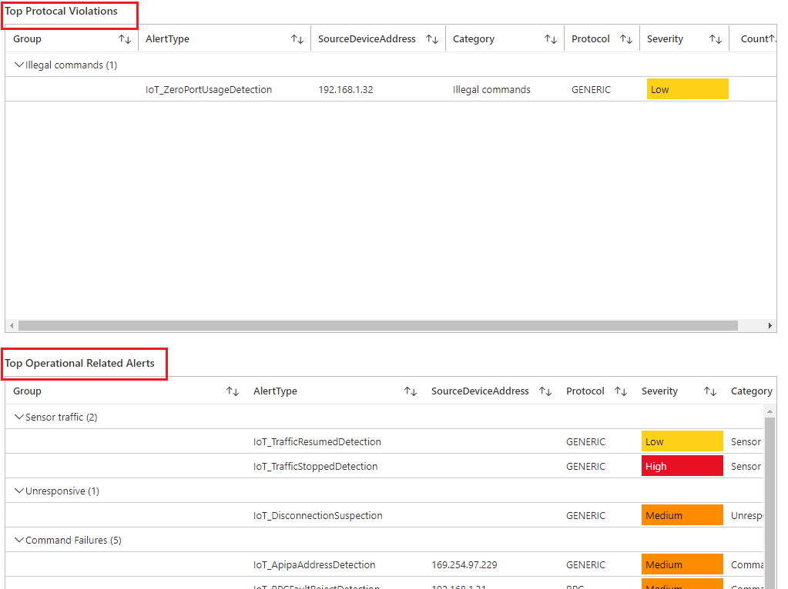
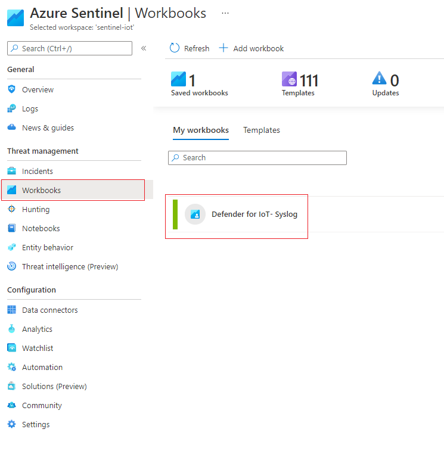

# Azure Sentinel Workbook - Defender for IoT

Interactive dashboard for Defender for IoT

 

  

## Table of Contents

1.  <u>Getting Started</u>

    -   <u>Prerequisites</u>

    -   <u>Installation</u>

2.  <u>Usage</u>

3.  <u>Contact</u>

 

## Getting Started

Use the following steps to correctly configure Defender for IoT Workbook
in your Azure Sentinel instance.

 

## Prerequisites

The workbook require you have Syslog data connector enabled and parser
installed.

-   Please refer to the data connector content here.

 

## Installation

1.  Download Workbook template

2.  Use Azure PowerShell to deploy Workbook in the same resource group
    as Azure Sentinel.

> $projectName = Read-Host -Prompt "Enter the same project name"
>
> $templateFile = Read-Host -Prompt "Enter the template file path and
> file name"
>
> $resourceGroupName = "${projectName}rg"
>
> New-AzResourceGroupDeployment \`
>
> -Name DeployLocalTemplate \`
>
> -ResourceGroupName $resourceGroupName \`
>
> -TemplateFile $templateFile \`
>
> -projectName $projectName \`
>
> -verbose

 

## Usage

To use the new workbook, navigate to Azure Sentinel->Workbooks->My
Workbooks

> 

 

## Contact

Email: <MicrosoftTeam@criticalstart.com>

## About

What we do:  
**Managed Detection and Response (MDR) Services:*** CRITICALSTART is the only MDR provider committed to eliminating acceptable risk and leaving nothing to chance. That’s why our security experts built a system, platform & service that quickly detects every event, resolves every alert & stops breaches.
Expertise beyond MDR, through our TEAMARES red and blue teams, including class-leading security practitioners (pen testers, assessors, forensic examiners) that provide hands-on support and expertise.   
**Cybersecurity Consulting services for Microsoft:** Delivered by highly trained and certified specialists, these services including educational workshops, assessments, design and implementation of Microsoft Security solutions.

